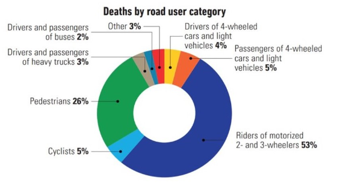

# Cyclist-Detection

According to research from the World Health Organization (WHO), it has been observed that cyclists have a significant impact on global traffic accident fatality statistics, contributing 3% to the total number of deaths. In Colombia, this figure is even higher, reaching 5% (World Health Organization, 2018). This highlights the importance of effectively addressing the safety challenges faced by cyclists on the roads, recognizing the need to implement preventive and protective measures. Additionally, it is crucial to consider that detecting and preventing collisions between autonomous vehicles (AVs) and cyclists represent a significant challenge. The environments in which cyclists travel are often dynamic and changing, making it difficult to anticipate their movements and behaviors.



From a technical standpoint, the accurate identification of Vulnerable Road Users (VRUs) remains one of the most challenging environment perception tasks for AVs. In fact, bicycles are arguably the most difficult detection problem faced by autonomous vehicle systems (Fairley, 2017; Mannion, 2019). Therefore, it will be necessary to enhance VRU detection capabilities to a level of human performance or beyond in the coming years, so that autonomous vehicles can minimize the risk they pose to VRUs.
Current Avs have many sensors and give control to driver for improving safety.
Incidents such as the Uber's accident and Tesla's accidents (2018, 2019) show that AVs (and drivers), can fail to detect cyclists.
To contribute to research in cyclist detection on roadways, we conducted web scraping tasks on databases such as COCO, KITTI, and Waymo. These databases contain pre-collected data. Using this data, we trained a model based on YOLO, which is a convolutional neural network architecture designed for object detection. The objective of our YOLO-based model is to detect cyclists on roadways. Once training is completed, within the repository called "cyclist detection," there is a folder containing images and text files. These text files contain ground truth information for each detected cyclist. Additionally, there are three files named part_1.pth, part_2.pth, and part_3.pth. These three files collectively form a single file containing the weights of the YOLO architecture trained for cyclist detection. Therefore, the first step is to combine these parts into a single .pth file.

##Description

This project aims to detect cyclists by applying image descriptors such as avg_angle, avg_distance, texture, and contrast. Using these descriptors, detection data is obtained in YOLO format (centroid_x, centroid_y, width, height). The project includes the loading and processing of 39 cyclist images, each with its corresponding text file.

##Repository Structure

```bash
Cyclist-Detection/
├── data/
│   ├── raw/
│   │   └── [raw data]
│   ├── processed/
│   │   └── cyclist_detection_Normalized_data.csv
├── results/
│   ├── figures/
│   │   └── [plots of the results]
│   ├── tables/
│   │   └── [statistical analysis table]
├── src/
│   ├── analysis/
│   │   ├── mathematical_algorithm/
│   │   │   └── mathematical_algorithm.py
│   │   ├── separability_of_data/
│   │   │   └── [data separability codes]
│   │   ├── statistical_description_of_data/
│   │   │   └── [statistical description code]
│   ├── preprocessing/
│   │   └── [data preprocessing code]
│   ├── visualization/
│   │   └── [data plotting code]
├── test/
│   └── test.py
├── .gitignore
├── README.md
├── requirements.txt

```

## Content

### 1. `data/`
- **raw/**: Contains the raw data.
- **processed/**: Contains the data in CSV format after applying the descriptors.

### 2. `results/`
- **figures/**: Contains the plots of the results.
- **tables/**: Contains a table of statistical analysis of the data.

### 3. `src/`
- **analysis/**
  - **mathematical_algorithm/**: Contains a `mathematical_algorithm.py` file that performs linear regression to estimate output values from input values.
  - **separability_of_data/**: Stores all codes to show data separability.
  - **statistical_description_of_data/**: Contains a code to perform statistical description of the data.
- **preprocessing/**: Performs data preprocessing.
- **visualization/**: Plots the data.

### 4. `test/`
- **test.py**: Includes an example code for the execution of the entire project.

## Requirements

Make sure to have the following dependencies installed before running the code:

- `numpy`
- `pandas` 
- `matplotlib` 
- `seaborn`
- `scikit-learn`
- `opencv-python`
- `scikit-image`
- `Python` 
##Usage
To execute the project, you need to clone the repository:
```bash
git clone https://github.com/LuisGomez-Meneses/Cyclist-Detection.git

```
You can install the dependencies by running:

```bash
pip install -r requirements.txt
```
Execute test.py to run the entire project


