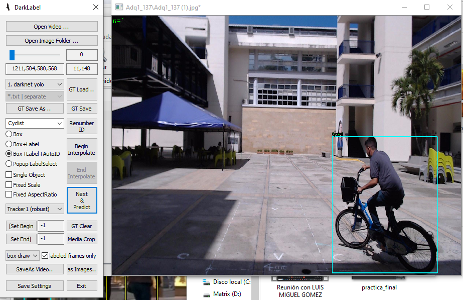

# data

This section of the repository contains all the data files and scripts related to the cyclist detection project.

## Table of Contents
- [File Description](#file-description)
- [Folder Structure](#folder-structure)
- [Contact](#contact)

## File Description

This section details the files and folders present in the `data` directory.
- `image/`: representative images of a process carried out, NOT of results
  - `example_labeling.PNG`: An example image showing manual labeling.
- `raw/`: Contains raw images obtained through web scraping techniques and from the COCO and KITTY databases.
  - `nocturnosjpeg/`: Contains images of cyclists taken at night.
    - `txt/`: `.txt` files corresponding to each image, representing cyclist detections in YOLO format.
  - `simplesjpeg/`: Contains images of cyclists taken during the day.
    - `txt/`: `.txt` files corresponding to each image, representing cyclist detections in YOLO format.
- `processed/`: Contains processed data files.
  - `cyclist_detection_data.csv`: The database composed of the Hough Transform descriptors `avg_angle` and `avg_distance`, as well as texture descriptors. These are the input data. The outputs are the YOLO detection data `cx`, `cy`, `w`, `h`, obtained by manually labeling the images using the ImageLabeling tool in YOLO format.
  - `cyclist_detection_Normalized_data.csv`: The database with normalized feature values.

### Example of Manual Labeling

Here is an example of manual labeling using the ImageLabeling tool in YOLO format:



## Folder Structure

The folder structure of the data section is as follows:
```bash
data/
│
├── raw/
│ ├── image/
│ ├── example_labeling.PNG
│ ├── nocturnosjpeg/
│ │ ├── Nocturnos (1).jpeg
│ │ ├── Nocturnos (2).jpeg
│ │ ├── .
│ │ ├── .
│ │ ├── Nocturnos (19).jpeg
│ │ └── txt/
│ │ ├── Nocturnos (1).txt
│ │ ├── Nocturnos (2).txt
│ │ ├── .
│ │ ├── .
│ │ ├── Nocturnos (19).txt
│ ├── simplesjpeg/
│ │ ├── Simples (1).jpeg
│ │ ├── Simples (2).jpeg
│ │ ├── .
│ │ ├── .
│ │ ├── Simples (19).jpeg
│ │ └── txt/
│ │ ├── Simples (1).txt
│ │ ├── Simples (2).txt
│ │ ├── .
│ │ ├── .
│ │ ├── Simples (19).txt
├── processed/
│ ├── cyclist_detection_data.csv
│ ├── cyclist_detection_Normalized_data.csv
└── README.md
```

## Contact
   ```bash
   email:luismiguelgomez0821@gmail.com
   ```